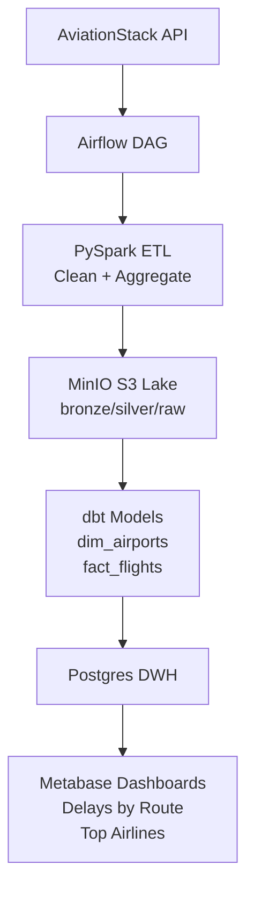

# Data Flight Pipeline

End-to-end aviation ETL: AviationStack API → MinIO → PySpark → Airflow → dbt → MinIO → Metabase

[](docker-compose.yml)
[](pyspark/)
[](dbt/)

## 💻 Stack

- 🛫 AviationStack API (free aviation data)
    - Future releases: Add OpenFlights CSVs and OpenSky API
- ⚡ PySpark ETL jobs
- 🌊 Airflow DAGs orchestration
- 🔄 dbt transformations + tests
- 🗄️ MinIO S3 lake + Postgres
- 📊 Metabase dashboards

## 💾 Storage

Free Oracle VPS (4 vCPUs, 32GB RAM, 200GB SSD)

[Oracle Cloud](https://www.oracle.com/es/cloud/)

## 🚀 Quickstart

```bash
docker compose up -d
```

**Access to:**

- **Airflow**: http://localhost:8080 (admin/admin)
- **MinIO**: http://localhost:9001 (minioadmin/minioadmin)
- **Metabase**: http://localhost:3000
- **dbt docs**: http://localhost:8080/dbt-docs

## 🛫 Dataset: Open Flights

Free aviation data from [https://aviationstack.com/](https://aviationstack.com/):

- 100 requests/month limit

## 🏗️ Architecture



| Layer          | Tech                     | Purpose                        |
| -------------- | ------------------------ | ------------------------------ |
| Ingestion      | Python Requests          | Free aviation APIs/CSVs        |
| Processing     | PySpark 3.5              | ETL batch (dedup, joins, aggs) |
| Orchestration  | Airflow 2.9              | Daily DAGs + SparkSubmit       |
| Transformation | dbt 1.8                  | SQL models + tests             |
| Storage        | MinIO (S3) + Postgres 15 | Lake + DWH                     |
| Viz            | Metabase                 | Executive dashboards           |
| Infra          | Docker Compose           | Local + VPS deploy             |

## 🎯 Highlights

- ✅ **End-to-End Data Engineering**: Ingest → Lake → DWH → BI
- ✅ **Production Stack**: Spark, Airflow, dbt, S3 (MinIO)
- ✅ **Aviation Domain**: Flights data
- ✅ **TDD**: dbt tests (duplicates, not_null, unique combos)
- ✅ **IaC**: Docker + GitHub Actions CI/CD
- ✅ **Scalable**: VPS-ready, AWS-like infra

## 📊 Sample Dashboards

_(Screenshots post-setup)_

- **Delays by Airport**: ORD, LHR top delay hubs
- **Route Popularity**: MAD-BCN vs NYC-LAX
- **Airline Load Factor**: IBE vs Ryanair

## 🔧 Local Development

```bash
# Dev mode (hot reload)
docker compose --profile dev up

# Run dbt manually
docker compose exec dbt dbt run --models fact_flights

# Test pipeline
docker compose exec airflow airflow dags test flights_etl_dag 2025-12-20
```

## 📈 Pipeline Metrics

| Metric        | Value      | dbt Test              |
| ------------- | ---------- | --------------------- |
| Daily Flights | 67K routes | ✅ unique_combination |
| Airports      | 7,100      | ✅ not_null 100%      |
| Airlines      | 5,900      | ✅ accepted_values    |
| Pipeline SLA  | <5min      | Airflow SLA           |

## 🤝 Contributing

1. Fork → Branch `feature/x`
2. Run `docker compose up`
3. Commit → PR

## 📄 License

MIT

---

**Built by Luis Andres Velazquez | Data Engineer @ [Next Digital Hub](https://www.nextdigital.es/)**
Seville, Spain 🇪🇸
